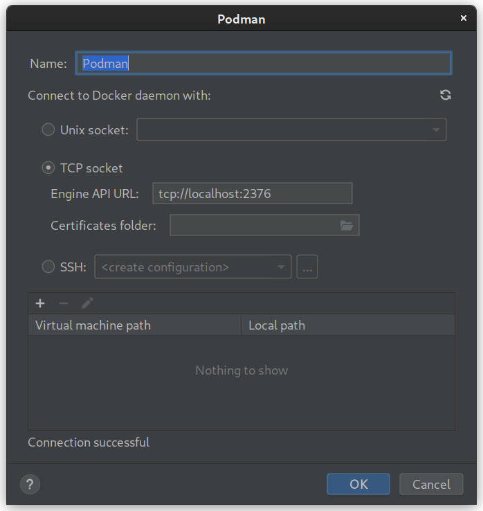

### This is a project template for running Postgres in Podman and using it how I like, via the IntelliJ GUI

Depending how you use this template, you may want to copy
* `.idea/runConfigurations/podman_service.xml`
* `.idea/runConfigurations/postgres.xml`
* `.idea/dataSources.xml`
* `sql/create.sql`
* `Dockerfile`

## Podman

Run the `podman service` run configuration or
```bash
podman system service -t 0 tcp://localhost:2376
```

Configure Podman as a Docker Daemon in IntelliJ



## Postgres

Edit `Dockerfile` for database name, user and password

Edit `sql/create.sql` as appropriate with your DDL

Either:

Run `postgres` run configuration

OR

Right click on `Dockerfile`, 🢒 Run Dockerfile

(you may need to add bind ports for 5432 and you probably want to add a container name)

OR

```bash
podman build . -t foo-db
```
```bash
podman run -p 5432:5432 foo-db
```

## Database Client

In the database panel, ➕ 🢒 *Data Source from URL:* 
```
jdbc:postgresql://localhost:5432/foo
```

## Misc

Note: I tried naming `Dockerfile` as `Containerfile` but IntelliJ doesn't support that too well.
For instance, right click 🢒 Run doesn't work